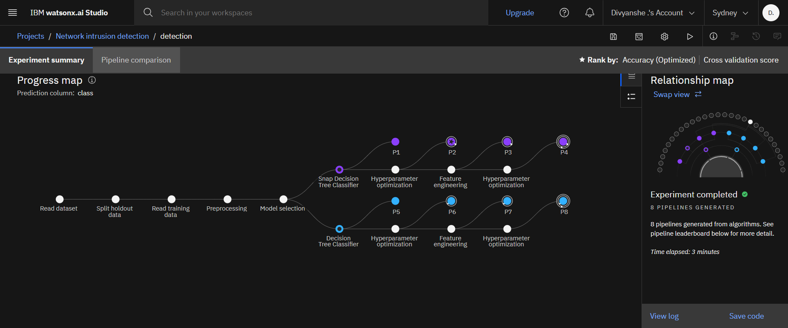
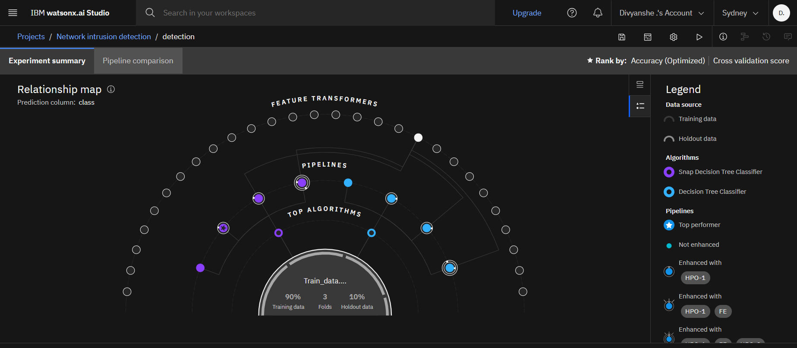
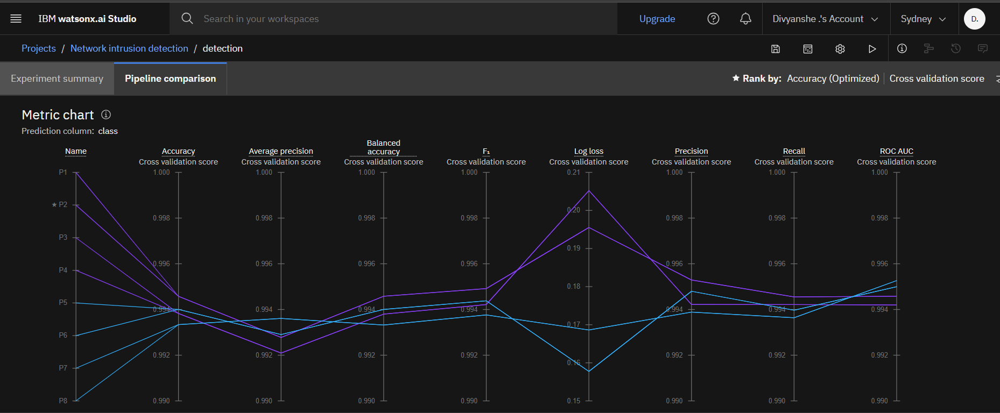
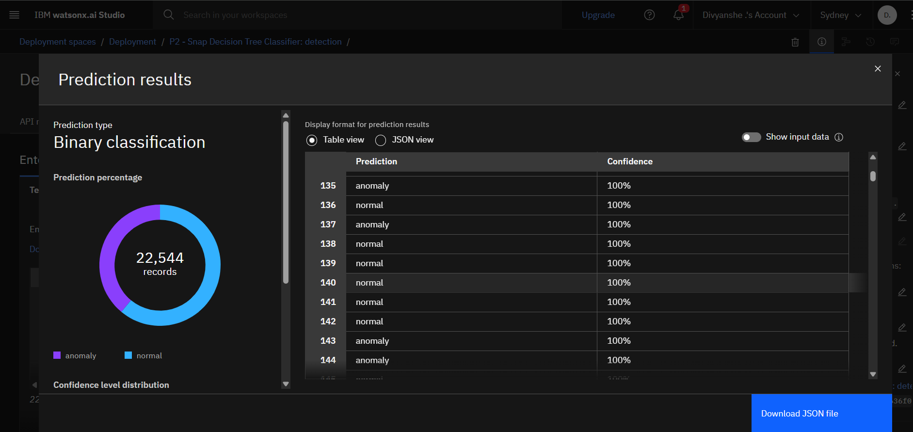

# Network-Intrusion-Detection-System
* This is a machine learning–based system designed to detect network anomalies that may indicate potential cyber threats.
* Developed using IBM Cloud and Watson Studio (Watson AI), it classifies network traffic as either normal or an anomaly, focusing on identifying unusual patterns.
* The project analyzes labeled network traffic data to differentiate regular activity from suspicious or unexpected behavior.
* Built using automated machine learning, the system is efficient, scalable, and well-suited for real-world cybersecurity applications.

# Dataset

* Source: [Kaggle – Network Intrusion Detection](https://www.kaggle.com/datasets/sampadab17/network-intrusion-detection)
* Format: CSV
* Target: class column indicating normal or an anomaly.
* Features: Include duration, protocol type, service, flag, source/destination bytes, and many more.

# Tools & Technologies
* IBM Watson Studio: Cloud-based platform for building and training models
* AutoAI (IBM Watson): Automated machine learning pipeline generation
* IBM Cloud Object Storage: Used to store and access the dataset
* Python (Jupyter Notebook): Used to run and visualize the AutoAI workflow.
* Watson Machine Learning Runtime: Execution environment for training and evaluating models

# Model used

* Decision Tree: A traditional, interpretable model suitable for classification tasks.
* Snap Decision Tree: A variation of the traditional Decision Tree algorithm, optimized for faster execution and simplified decision-making while maintaining similar classification logic.

# Model Workflow

This section outlines the full end-to-end process used to build and evaluate the model:

1. Data upload and schema detection  
2. Preprocessing and feature engineering  
3. Model experimentation using various algorithms  
4. Automatic pipeline selection based on validation scores  
5. Evaluation and export of best-performing model

 

 

# Model Architecture Insights

* The system intelligently connects components such as data transformers, feature selectors, and model evaluators.
* It also incorporates a 3-fold cross-validation approach along with a separate holdout set for final model assessment.
* This architecture ensures high reusability, scalability, and a clear structure for managing various machine learning tasks.

 

 

# Evaluation

Model performance was assessed using cross-validation across several key metrics:
* Accuracy
* Precision
* Recall
* F1-Score
* Log Loss
* ROC-AUC

These metrics helped in identifying the most balanced and robust model for intrusion detection.

 

 

# Result

The model was deployed using IBM Watson Studio and tested on real network traffic samples. The system outputs binary classification results that determine whether the observed traffic is normal or an anomaly, helping identify potential threats in the network.

 

 

# Disclaimer

* The dataset used in this project belongs to its original creators on Kaggle. This repository uses the dataset solely for educational and research purposes.
